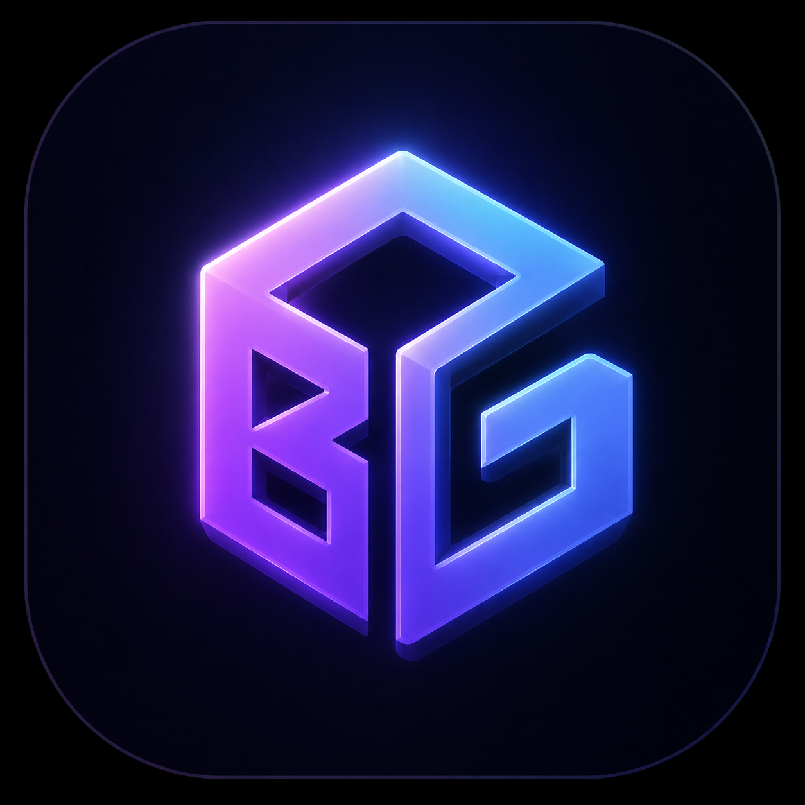

# BG Camera Studio

> 360° パノラマ画像をリアルタイムで見回し、好きな構図で PNG 出力できる軽量スタジオツール



## できること

### 🌐 Panorama Mode（実装済み）
- 360° パノラマ画像（equirectangular）をドラッグ&ドロップで読み込み
- 球体内側を自由に見回す（ドラッグで回転）
- スクロールでズーム（FOV: 30°〜120°）
- カメラの傾き（ロール）を調整（Tilt ツール）
- ペイント / アノテーション（ブラシ・消しゴム・テキスト）
- 明るさ・彩度・色温度の調整
- PNG 書き出し（5 つのプリセット対応）

### 出力プリセット
| プリセット | サイズ |
|-----------|--------|
| YouTube 動画背景 | 1920×1080 |
| YouTube Shorts / TikTok | 1080×1920 |
| サムネイル | 1280×720 |
| Instagram 正方形 | 1024×1024 |
| Instagram 4:5 | 1080×1350 |
| カスタム | 任意サイズ |

### 🔧 Image Background Mode（開発予定）
- 通常の背景画像を Depth AI で 2.5D 化
- 疑似 3D でカメラ位置を微調整して再構図
- → 現時点ではパノラマモードのみ利用可能

---

## セットアップ

### 必要環境
- **Node.js 18+**

### インストール & 起動

```bash
cd frontend
npm install
npm run dev
```

ブラウザで **http://localhost:5173** を開いてください。

---

## 使い方

1. 中央エリアに 360° パノラマ画像をドロップ（または「サンプルを読み込む」）
2. ドラッグで視点を回転、スクロールでズーム
3. **Pan** ツール：視点の回転操作
4. **Tilt** ツール：左右ドラッグでカメラを傾ける（スライダー・リセット付き）
5. **Paint** ツール：ブラシ・消しゴム・テキストでアノテーション
6. 左サイドバーのプリセットを選んで **PNG 書き出し**

---

## 対応フォーマット
- JPEG / JPG
- PNG
- WebP

---

## 技術スタック

| レイヤー | 技術 |
|---------|------|
| フロントエンド | Vite + React + TypeScript |
| 3D エンジン | Three.js（R3F 不使用） |
| 状態管理 | Zustand |
| スタイル | Tailwind CSS |
| 言語対応 | 日本語 / English / 中文 |

---

## ロードマップ

- [x] 360° パノラマ表示・見回し
- [x] FOV スライダー
- [x] カメラ傾き（Tilt ツール）
- [x] ペイント / アノテーション
- [x] 明るさ・彩度・色温度調整
- [x] PNG 出力プリセット
- [ ] 通常画像の Depth 推定 → 2.5D 表示
- [ ] 3D Gaussian Splat 表示

---

## ライセンス

個人利用のみ可・再配布／販売禁止のプロプライエタリライセンスです。
ソースコードの閲覧と個人利用は自由ですが、再配布・改変版の配布・販売・
自身のサービスとしての公開は禁止しています。詳細は [LICENSE](LICENSE) を参照してください。
